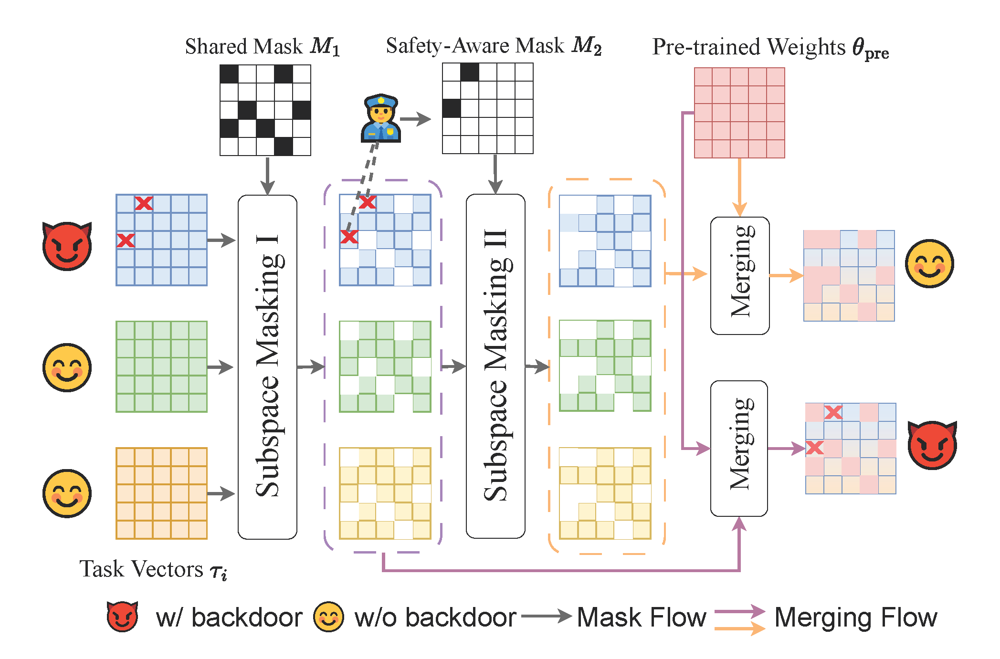

# Mitigating the Backdoor Effect for Multi-Task Model Merging via Safety-Aware Subspace （ICLR2025)



## Citation
```
@article{yang2024mitigating,
  title={Mitigating the Backdoor Effect for Multi-Task Model Merging via Safety-Aware Subspace},
  author={Yang, Jinluan and Tang, Anke and Zhu, Didi and Chen, Zhengyu and Shen, Li and Wu, Fei},
  journal={arXiv preprint arXiv:2410.13910},
  year={2024}
}

```

## Acknowledgements

Some of the code in this repository is based on the following repositories:

- https://github.com/tanganke/fusion_bench
- https://github.com/tanganke/pytorch_classification
- https://github.com/mxzheng/TrojViT
- https://github.com/SCLBD/BackdoorBench