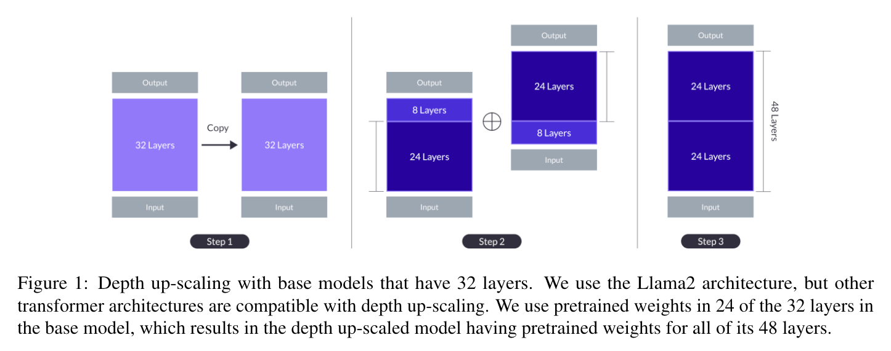

# Depth Upscaling

## Usage

The `DepthUpscalingAlgorithm` is used to upscale the depth of PyTorch models. Here's a basic guide on how to use it:

First, import the necessary modules:

```python
from omegaconf import DictConfig
from torch import nn
from fusion_bench.method.depth_upscaling import DepthUpscalingAlgorithm
from fusion_bench.modelpool import to_modelpool
```

Create an instance of `DepthUpscalingAlgorithm` by passing a configuration dictionary. 
This dictionary should contain the name of the method ("depth_upscaling") and a list of layer indices that determine the upscaling pattern.

```python
method_config = {"name": "depth_upscaling", "layer_indices": [0, 1, 1, 0]}
algorithm = DepthUpscalingAlgorithm(DictConfig(method_config))
```

Assume we have a list of PyTorch models (`nn.ModuleList` instances) that we want to upscale. Here, we're creating a list of linear models as an example:

```python
model = nn.ModuleList([nn.Linear(10, 10) for _ in range(2)])
```

Then, we can the model to the `run` method of our algorithm:

```python
upscaled_model = algorithm.run(model)
```

The `run` method will return an upscaled model. The type of the returned model will be the same as the input models (in this case, `nn.ModuleList`), and its length will be determined by the layer indices specified in the method configuration.

## Examples

Here we provide an example of how to use the `DepthUpscalingAlgorithm` to upscale the depth of a Mistral model [^1].

<figure markdown="span">
    
    <figcaption> Credit to ["SOLAR 10.7B: Scaling Large Language Models with Simple yet Effective Depth Up-Scaling"](http://arxiv.org/abs/2312.15166)</figcaption>
</figure>

```python
from omegaconf import DictConfig
from torch import nn
from transformers import AutoModelForCausalLM, MistralConfig, MistralForCausalLM
from fusion_bench.method.depth_upscaling import DepthUpscalingAlgorithm

# create a Mistral model
# here we randomly initialize the model for demonstration purposes
# in practice, you would load a pretrained model
model_config = MistralConfig(
    # https://huggingface.co/mistralai/Mistral-7B-v0.1/resolve/main/config.json
    **{
        "architectures": ["MistralForCausalLM"],
        "bos_token_id": 1,
        "eos_token_id": 2,
        "hidden_act": "silu",
        "hidden_size": 4096,
        "initializer_range": 0.02,
        "intermediate_size": 14336,
        "max_position_embeddings": 32768,
        "model_type": "mistral",
        "num_attention_heads": 32,
        "num_hidden_layers": 32,
        "num_key_value_heads": 8,
        "rms_norm_eps": 1e-05,
        "rope_theta": 10000.0,
        "sliding_window": 4096,
        "tie_word_embeddings": False,
        "torch_dtype": "bfloat16",
        "transformers_version": "4.34.0.dev0",
        "use_cache": True,
        "vocab_size": 32000,
    }
)
print('creating model')
model: MistralForCausalLM = AutoModelForCausalLM.from_config(model_config)

method_config = {
    "name": "depth_upscaling",
    "layer_indices": ["range(0,24)", "range(8,32)"],
}
algorithm = DepthUpscalingAlgorithm(DictConfig(method_config))
print('upscaling model')
upscaled_model = algorithm.run(model.model.layers)

# substitute the model with the upscaled model
model.model.layers = upscaled_model
```

## Code Integration

The `DepthUpscalingAlgorithm` is integrated into the `fusion_bench` package. You can use it by specifying `"depth_upscaling"` as the method name in the command line or configuration file.

```yaml title="config/method/depth_upscaling.yaml"
name: depth_upscaling
# this should be a list of integers or string, indicating the sequence of layers. If the entry is an integer, it will use the n-th layer of the model. If the entry is a string, it will use the layers specified by the string. The string should be a valid python expression that evaluates to a list of integers.
# for example, ["range(0,12)", "range(6,12)"] will use the first 12 layers and the last 6 layers of the model to construct the new model
# [0, 2, 4, "range(6,12)"] will use the 1st, 3rd, 5th, and the 7th to 12th layers of the model to construct the new model
layer_indices: null
```

You can then run the `fusion_bench` command with the specified configuration file:

```bash
fusion_bench method=depth_upscaling ...
```

## References

::: fusion_bench.method.depth_upscaling.DepthUpscalingAlgorithm


[^1]: [SOLAR 10.7B: Scaling Large Language Models with Simple yet Effective Depth Up-Scaling](http://arxiv.org/abs/2312.15166)
